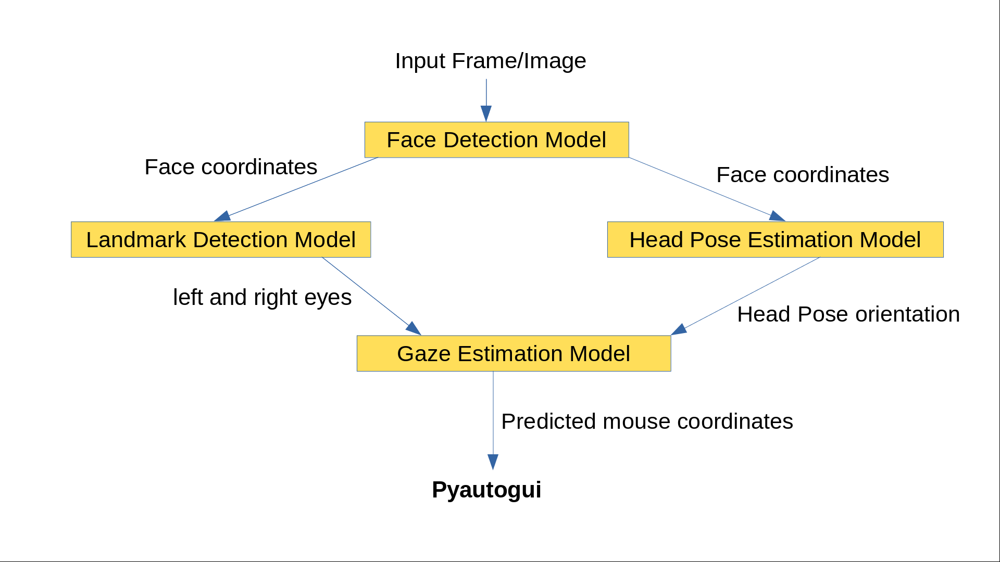
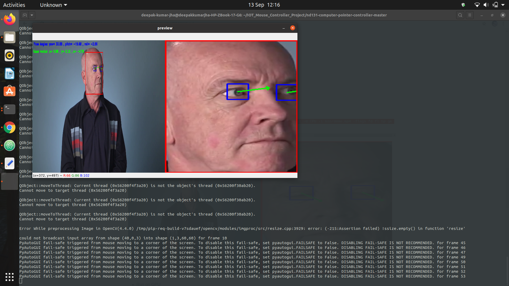
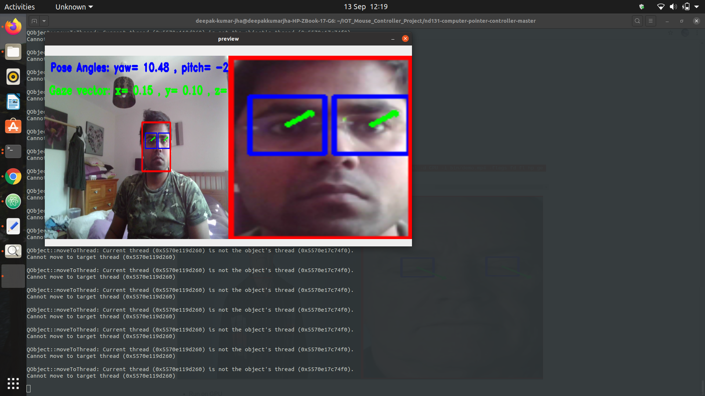

# Computer Pointer Controller

In this project, we will use a gaze detection model to control the mouse pointer of your computer. You will be using the Gaze Estimation model to estimate the gaze of the user's eyes and change the mouse pointer position accordingly. This project will demonstrate your ability to run multiple models in the same machine and coordinate the flow of data between those models.

04 pre-trained models from the Intel Pre-trained Models Zoo have to be used:
* [Face Detection](https://docs.openvinotoolkit.org/latest/omz_models_intel_face_detection_adas_binary_0001_description_face_detection_adas_binary_0001.html)
* [Head Pose Estimation](https://docs.openvinotoolkit.org/latest/omz_models_intel_head_pose_estimation_adas_0001_description_head_pose_estimation_adas_0001.html)
* [Facial LandMarks Detection](https://docs.openvinotoolkit.org/latest/omz_models_intel_landmarks_regression_retail_0009_description_landmarks_regression_retail_0009.html)
* [Gaze Estimation Model](https://docs.openvinotoolkit.org/latest/omz_models_intel_gaze_estimation_adas_0002_description_gaze_estimation_adas_0002.html)

The flow of data look like this:



## Project Set Up and Installation
My project setup was Ubuntu 20.04, where i installed OpenVINO 2020.4 module and compiled it from source code.
* Download [OpenVINO ToolKit](https://docs.openvinotoolkit.org/latest/index.html) and install it locally.
* Download the project zip file and extract it.
* Create and activate a virtual environment

   `pip install virtualenv`

   `virtualenv venv`

   `cd venv/Scripts/` or `cd venv/bin`

   `activate`

* Install dependencies

  `pip install -r requirements.txt`

* Initialize OpenVINO environment

  `source /opt/intel/openvino/bin/setupvars.sh`

 * Download models

   create models folder in project directory
   `mkdir models`

   and then download models in that directory

   `/opt/intel/openvino/deployment_tools/tools/model_downloader/downloader.py --name head-pose-estimation-adas-0001 --precisions FP16 -o models`

   `/opt/intel/openvino/deployment_tools/tools/model_downloader/downloader.py --name head-pose-estimation-adas-0001 --precisions FP32 -o models`

   `/opt/intel/openvino/deployment_tools/tools/model_downloader/downloader.py --name face-detection-adas-binary-0001  -o models`


   `/opt/intel/openvino/deployment_tools/tools/model_downloader/downloader.py --name landmarks-regression-retail-0009 --precisions FP16 -o models`

   `/opt/intel/openvino/deployment_tools/tools/model_downloader/downloader.py --name landmarks-regression-retail-0009 --precisions FP32 -o models`

   `/opt/intel/openvino/deployment_tools/tools/model_downloader/downloader.py --name gaze-estimation-adas-0002 --precisions FP16 -o models`

   `/opt/intel/openvino/deployment_tools/tools/model_downloader/downloader.py --name gaze-estimation-adas-0002 --precisions FP32 -o models`


Refer below is the project structure:

The bin folder contains the demo video file, the models folder contains all the Intel's Pretrained models needed for execution, and the src folder contains all necessary python files.
```
[setupvars.sh] OpenVINO environment initialized
(base) deepak-kumar-jha@deepakkumarjha-HP-ZBook-17-G6:~/IOT_Mouse_Controller_Project/starter$ tree
.
├── bin
│   └── demo.mp4
├── images
│   ├── image1.png
│   ├── image2.png
│   └── Model_pipeline.png
├── models
│   └── intel
│       ├── face-detection-adas-binary-0001
│       │   └── FP32-INT1
│       │       ├── face-detection-adas-binary-0001.bin
│       │       └── face-detection-adas-binary-0001.xml
│       ├── gaze-estimation-adas-0002
│       │   ├── FP16
│       │   │   ├── gaze-estimation-adas-0002.bin
│       │   │   └── gaze-estimation-adas-0002.xml
│       │   └── FP32
│       │       ├── gaze-estimation-adas-0002.bin
│       │       └── gaze-estimation-adas-0002.xml
│       ├── head-pose-estimation-adas-0001
│       │   ├── FP16
│       │   │   ├── head-pose-estimation-adas-0001.bin
│       │   │   └── head-pose-estimation-adas-0001.xml
│       │   └── FP32
│       │       ├── head-pose-estimation-adas-0001.bin
│       │       └── head-pose-estimation-adas-0001.xml
│       └── landmarks-regression-retail-0009
│           ├── FP16
│           │   ├── landmarks-regression-retail-0009.bin
│           │   └── landmarks-regression-retail-0009.xml
│           └── FP32
│               ├── landmarks-regression-retail-0009.bin
│               └── landmarks-regression-retail-0009.xml
├── README.md
├── requirements.txt
├── src
│   ├── input_feeder.py
│   ├── main_project.py
│   ├── model.py
│   ├── mouse_controller.py
│   ├── __pycache__
│   │   ├── input_feeder.cpython-37.pyc
│   │   ├── model.cpython-37.pyc
│   │   └── mouse_controller.cpython-37.pyc
│   └── stats.txt
└── venv
    ├── bin
    │   ├── activate
    │   ├── activate.csh
    │   ├── activate.fish
    │   ├── activate.ps1
    │   ├── activate_this.py
    │   ├── activate.xsh
    │   ├── easy_install
    │   ├── easy_install3
    │   ├── easy_install-3.7
    │   ├── easy_install3.7
    │   ├── pip
    │   ├── pip3
    │   ├── pip-3.7
    │   ├── pip3.7
    │   ├── python -> /home/deepak-kumar-jha/anaconda3/bin/python
    │   ├── python3 -> python
    │   ├── python3.7 -> python
    │   ├── wheel
    │   ├── wheel3
    │   ├── wheel-3.7
    │   └── wheel3.7
    ├── lib
    │   └── python3.7
    │       └── site-packages
    │           ├── _distutils_hack
    │           │   ├── __init__.py
    │           │   └── override.py
    │           ├── distutils-precedence.pth
    │           ├── easy_install.py
    │           ├── pip
    │           │   ├── __init__.py
    │           │   ├── _internal
    │           │   │   ├── build_env.py
    │           │   │   ├── cache.py
    │           │   │   ├── cli
    │           │   │   │   ├── autocompletion.py
    │           │   │   │   ├── base_command.py
    │           │   │   │   ├── cmdoptions.py
    │           │   │   │   ├── command_context.py
    │           │   │   │   ├── __init__.py
    │           │   │   │   ├── main_parser.py
    │           │   │   │   ├── main.py
    │           │   │   │   ├── parser.py
    │           │   │   │   ├── progress_bars.py
    │           │   │   │   ├── req_command.py
    │           │   │   │   ├── spinners.py
    │           │   │   │   └── status_codes.py
    │           │   │   ├── commands
    │           │   │   │   ├── cache.py
    │           │   │   │   ├── check.py
    │           │   │   │   ├── completion.py
    │           │   │   │   ├── configuration.py
    │           │   │   │   ├── debug.py
    │           │   │   │   ├── download.py
    │           │   │   │   ├── freeze.py
    │           │   │   │   ├── hash.py
    │           │   │   │   ├── help.py
    │           │   │   │   ├── __init__.py
    │           │   │   │   ├── install.py
    │           │   │   │   ├── list.py
    │           │   │   │   ├── search.py
    │           │   │   │   ├── show.py
    │           │   │   │   ├── uninstall.py
    │           │   │   │   └── wheel.py
    │           │   │   ├── configuration.py
    │           │   │   ├── distributions
    │           │   │   │   ├── base.py
    │           │   │   │   ├── __init__.py
    │           │   │   │   ├── installed.py
    │           │   │   │   ├── sdist.py
    │           │   │   │   └── wheel.py
    │           │   │   ├── exceptions.py
    │           │   │   ├── index
    │           │   │   │   ├── collector.py
    │           │   │   │   ├── __init__.py
    │           │   │   │   └── package_finder.py
    │           │   │   ├── __init__.py
    │           │   │   ├── locations.py
    │           │   │   ├── main.py
    │           │   │   ├── models
    │           │   │   │   ├── candidate.py
    │           │   │   │   ├── direct_url.py
    │           │   │   │   ├── format_control.py
    │           │   │   │   ├── index.py
    │           │   │   │   ├── __init__.py
    │           │   │   │   ├── link.py
    │           │   │   │   ├── scheme.py
    │           │   │   │   ├── search_scope.py
    │           │   │   │   ├── selection_prefs.py
    │           │   │   │   ├── target_python.py
    │           │   │   │   └── wheel.py
    │           │   │   ├── network
    │           │   │   │   ├── auth.py
    │           │   │   │   ├── cache.py
    │           │   │   │   ├── download.py
    │           │   │   │   ├── __init__.py
    │           │   │   │   ├── lazy_wheel.py
    │           │   │   │   ├── session.py
    │           │   │   │   ├── utils.py
    │           │   │   │   └── xmlrpc.py
    │           │   │   ├── operations
    │           │   │   │   ├── build
    │           │   │   │   │   ├── __init__.py
    │           │   │   │   │   ├── metadata_legacy.py
    │           │   │   │   │   ├── metadata.py
    │           │   │   │   │   ├── wheel_legacy.py
    │           │   │   │   │   └── wheel.py
    │           │   │   │   ├── check.py
    │           │   │   │   ├── freeze.py
    │           │   │   │   ├── __init__.py
    │           │   │   │   ├── install
    │           │   │   │   │   ├── editable_legacy.py
    │           │   │   │   │   ├── __init__.py
    │           │   │   │   │   ├── legacy.py
    │           │   │   │   │   └── wheel.py
    │           │   │   │   └── prepare.py
    │           │   │   ├── pyproject.py
    │           │   │   ├── req
    │           │   │   │   ├── constructors.py
    │           │   │   │   ├── __init__.py
    │           │   │   │   ├── req_file.py
    │           │   │   │   ├── req_install.py
    │           │   │   │   ├── req_set.py
    │           │   │   │   ├── req_tracker.py
    │           │   │   │   └── req_uninstall.py
    │           │   │   ├── resolution
    │           │   │   │   ├── base.py
    │           │   │   │   ├── __init__.py
    │           │   │   │   ├── legacy
    │           │   │   │   │   ├── __init__.py
    │           │   │   │   │   └── resolver.py
    │           │   │   │   └── resolvelib
    │           │   │   │       ├── base.py
    │           │   │   │       ├── candidates.py
    │           │   │   │       ├── factory.py
    │           │   │   │       ├── __init__.py
    │           │   │   │       ├── provider.py
    │           │   │   │       ├── requirements.py
    │           │   │   │       └── resolver.py
    │           │   │   ├── self_outdated_check.py
    │           │   │   ├── utils
    │           │   │   │   ├── appdirs.py
    │           │   │   │   ├── compatibility_tags.py
    │           │   │   │   ├── compat.py
    │           │   │   │   ├── datetime.py
    │           │   │   │   ├── deprecation.py
    │           │   │   │   ├── direct_url_helpers.py
    │           │   │   │   ├── distutils_args.py
    │           │   │   │   ├── encoding.py
    │           │   │   │   ├── entrypoints.py
    │           │   │   │   ├── filesystem.py
    │           │   │   │   ├── filetypes.py
    │           │   │   │   ├── glibc.py
    │           │   │   │   ├── hashes.py
    │           │   │   │   ├── __init__.py
    │           │   │   │   ├── inject_securetransport.py
    │           │   │   │   ├── logging.py
    │           │   │   │   ├── misc.py
    │           │   │   │   ├── models.py
    │           │   │   │   ├── packaging.py
    │           │   │   │   ├── parallel.py
    │           │   │   │   ├── pkg_resources.py
    │           │   │   │   ├── setuptools_build.py
    │           │   │   │   ├── subprocess.py
    │           │   │   │   ├── temp_dir.py
    │           │   │   │   ├── typing.py
    │           │   │   │   ├── unpacking.py
    │           │   │   │   ├── urls.py
    │           │   │   │   ├── virtualenv.py
    │           │   │   │   └── wheel.py
    │           │   │   ├── vcs
    │           │   │   │   ├── bazaar.py
    │           │   │   │   ├── git.py
    │           │   │   │   ├── __init__.py
    │           │   │   │   ├── mercurial.py
    │           │   │   │   ├── subversion.py
    │           │   │   │   └── versioncontrol.py
    │           │   │   └── wheel_builder.py
    │           │   ├── __main__.py
    │           │   └── _vendor
    │           │       ├── appdirs.py
    │           │       ├── cachecontrol
    │           │       │   ├── adapter.py
    │           │       │   ├── cache.py
    │           │       │   ├── caches
    │           │       │   │   ├── file_cache.py
    │           │       │   │   ├── __init__.py
    │           │       │   │   └── redis_cache.py
    │           │       │   ├── _cmd.py
    │           │       │   ├── compat.py
    │           │       │   ├── controller.py
    │           │       │   ├── filewrapper.py
    │           │       │   ├── heuristics.py
    │           │       │   ├── __init__.py
    │           │       │   ├── serialize.py
    │           │       │   └── wrapper.py
    │           │       ├── certifi
    │           │       │   ├── cacert.pem
    │           │       │   ├── core.py
    │           │       │   ├── __init__.py
    │           │       │   └── __main__.py
    │           │       ├── chardet
    │           │       │   ├── big5freq.py
    │           │       │   ├── big5prober.py
    │           │       │   ├── chardistribution.py
    │           │       │   ├── charsetgroupprober.py
    │           │       │   ├── charsetprober.py
    │           │       │   ├── cli
    │           │       │   │   ├── chardetect.py
    │           │       │   │   └── __init__.py
    │           │       │   ├── codingstatemachine.py
    │           │       │   ├── compat.py
    │           │       │   ├── cp949prober.py
    │           │       │   ├── enums.py
    │           │       │   ├── escprober.py
    │           │       │   ├── escsm.py
    │           │       │   ├── eucjpprober.py
    │           │       │   ├── euckrfreq.py
    │           │       │   ├── euckrprober.py
    │           │       │   ├── euctwfreq.py
    │           │       │   ├── euctwprober.py
    │           │       │   ├── gb2312freq.py
    │           │       │   ├── gb2312prober.py
    │           │       │   ├── hebrewprober.py
    │           │       │   ├── __init__.py
    │           │       │   ├── jisfreq.py
    │           │       │   ├── jpcntx.py
    │           │       │   ├── langbulgarianmodel.py
    │           │       │   ├── langcyrillicmodel.py
    │           │       │   ├── langgreekmodel.py
    │           │       │   ├── langhebrewmodel.py
    │           │       │   ├── langhungarianmodel.py
    │           │       │   ├── langthaimodel.py
    │           │       │   ├── langturkishmodel.py
    │           │       │   ├── latin1prober.py
    │           │       │   ├── mbcharsetprober.py
    │           │       │   ├── mbcsgroupprober.py
    │           │       │   ├── mbcssm.py
    │           │       │   ├── sbcharsetprober.py
    │           │       │   ├── sbcsgroupprober.py
    │           │       │   ├── sjisprober.py
    │           │       │   ├── universaldetector.py
    │           │       │   ├── utf8prober.py
    │           │       │   └── version.py
    │           │       ├── colorama
    │           │       │   ├── ansi.py
    │           │       │   ├── ansitowin32.py
    │           │       │   ├── initialise.py
    │           │       │   ├── __init__.py
    │           │       │   ├── win32.py
    │           │       │   └── winterm.py
    │           │       ├── contextlib2.py
    │           │       ├── distlib
    │           │       │   ├── _backport
    │           │       │   │   ├── __init__.py
    │           │       │   │   ├── misc.py
    │           │       │   │   ├── shutil.py
    │           │       │   │   ├── sysconfig.cfg
    │           │       │   │   ├── sysconfig.py
    │           │       │   │   └── tarfile.py
    │           │       │   ├── compat.py
    │           │       │   ├── database.py
    │           │       │   ├── index.py
    │           │       │   ├── __init__.py
    │           │       │   ├── locators.py
    │           │       │   ├── manifest.py
    │           │       │   ├── markers.py
    │           │       │   ├── metadata.py
    │           │       │   ├── resources.py
    │           │       │   ├── scripts.py
    │           │       │   ├── t32.exe
    │           │       │   ├── t64.exe
    │           │       │   ├── util.py
    │           │       │   ├── version.py
    │           │       │   ├── w32.exe
    │           │       │   ├── w64.exe
    │           │       │   └── wheel.py
    │           │       ├── distro.py
    │           │       ├── html5lib
    │           │       │   ├── constants.py
    │           │       │   ├── filters
    │           │       │   │   ├── alphabeticalattributes.py
    │           │       │   │   ├── base.py
    │           │       │   │   ├── __init__.py
    │           │       │   │   ├── inject_meta_charset.py
    │           │       │   │   ├── lint.py
    │           │       │   │   ├── optionaltags.py
    │           │       │   │   ├── sanitizer.py
    │           │       │   │   └── whitespace.py
    │           │       │   ├── html5parser.py
    │           │       │   ├── _ihatexml.py
    │           │       │   ├── __init__.py
    │           │       │   ├── _inputstream.py
    │           │       │   ├── serializer.py
    │           │       │   ├── _tokenizer.py
    │           │       │   ├── treeadapters
    │           │       │   │   ├── genshi.py
    │           │       │   │   ├── __init__.py
    │           │       │   │   └── sax.py
    │           │       │   ├── treebuilders
    │           │       │   │   ├── base.py
    │           │       │   │   ├── dom.py
    │           │       │   │   ├── etree_lxml.py
    │           │       │   │   ├── etree.py
    │           │       │   │   └── __init__.py
    │           │       │   ├── treewalkers
    │           │       │   │   ├── base.py
    │           │       │   │   ├── dom.py
    │           │       │   │   ├── etree_lxml.py
    │           │       │   │   ├── etree.py
    │           │       │   │   ├── genshi.py
    │           │       │   │   └── __init__.py
    │           │       │   ├── _trie
    │           │       │   │   ├── _base.py
    │           │       │   │   ├── __init__.py
    │           │       │   │   └── py.py
    │           │       │   └── _utils.py
    │           │       ├── idna
    │           │       │   ├── codec.py
    │           │       │   ├── compat.py
    │           │       │   ├── core.py
    │           │       │   ├── idnadata.py
    │           │       │   ├── __init__.py
    │           │       │   ├── intranges.py
    │           │       │   ├── package_data.py
    │           │       │   └── uts46data.py
    │           │       ├── __init__.py
    │           │       ├── ipaddress.py
    │           │       ├── msgpack
    │           │       │   ├── exceptions.py
    │           │       │   ├── ext.py
    │           │       │   ├── fallback.py
    │           │       │   ├── __init__.py
    │           │       │   └── _version.py
    │           │       ├── packaging
    │           │       │   ├── __about__.py
    │           │       │   ├── _compat.py
    │           │       │   ├── __init__.py
    │           │       │   ├── markers.py
    │           │       │   ├── requirements.py
    │           │       │   ├── specifiers.py
    │           │       │   ├── _structures.py
    │           │       │   ├── tags.py
    │           │       │   ├── _typing.py
    │           │       │   ├── utils.py
    │           │       │   └── version.py
    │           │       ├── pep517
    │           │       │   ├── build.py
    │           │       │   ├── check.py
    │           │       │   ├── colorlog.py
    │           │       │   ├── compat.py
    │           │       │   ├── dirtools.py
    │           │       │   ├── envbuild.py
    │           │       │   ├── __init__.py
    │           │       │   ├── _in_process.py
    │           │       │   ├── meta.py
    │           │       │   └── wrappers.py
    │           │       ├── pkg_resources
    │           │       │   ├── __init__.py
    │           │       │   └── py31compat.py
    │           │       ├── progress
    │           │       │   ├── bar.py
    │           │       │   ├── counter.py
    │           │       │   ├── __init__.py
    │           │       │   └── spinner.py
    │           │       ├── pyparsing.py
    │           │       ├── requests
    │           │       │   ├── adapters.py
    │           │       │   ├── api.py
    │           │       │   ├── auth.py
    │           │       │   ├── certs.py
    │           │       │   ├── compat.py
    │           │       │   ├── cookies.py
    │           │       │   ├── exceptions.py
    │           │       │   ├── help.py
    │           │       │   ├── hooks.py
    │           │       │   ├── __init__.py
    │           │       │   ├── _internal_utils.py
    │           │       │   ├── models.py
    │           │       │   ├── packages.py
    │           │       │   ├── sessions.py
    │           │       │   ├── status_codes.py
    │           │       │   ├── structures.py
    │           │       │   ├── utils.py
    │           │       │   └── __version__.py
    │           │       ├── resolvelib
    │           │       │   ├── compat
    │           │       │   │   ├── collections_abc.py
    │           │       │   │   └── __init__.py
    │           │       │   ├── __init__.py
    │           │       │   ├── providers.py
    │           │       │   ├── reporters.py
    │           │       │   ├── resolvers.py
    │           │       │   └── structs.py
    │           │       ├── retrying.py
    │           │       ├── six.py
    │           │       ├── toml
    │           │       │   ├── common.py
    │           │       │   ├── decoder.py
    │           │       │   ├── encoder.py
    │           │       │   ├── __init__.py
    │           │       │   ├── ordered.py
    │           │       │   └── tz.py
    │           │       ├── urllib3
    │           │       │   ├── _collections.py
    │           │       │   ├── connectionpool.py
    │           │       │   ├── connection.py
    │           │       │   ├── contrib
    │           │       │   │   ├── _appengine_environ.py
    │           │       │   │   ├── appengine.py
    │           │       │   │   ├── __init__.py
    │           │       │   │   ├── ntlmpool.py
    │           │       │   │   ├── pyopenssl.py
    │           │       │   │   ├── _securetransport
    │           │       │   │   │   ├── bindings.py
    │           │       │   │   │   ├── __init__.py
    │           │       │   │   │   └── low_level.py
    │           │       │   │   ├── securetransport.py
    │           │       │   │   └── socks.py
    │           │       │   ├── exceptions.py
    │           │       │   ├── fields.py
    │           │       │   ├── filepost.py
    │           │       │   ├── __init__.py
    │           │       │   ├── packages
    │           │       │   │   ├── backports
    │           │       │   │   │   ├── __init__.py
    │           │       │   │   │   └── makefile.py
    │           │       │   │   ├── __init__.py
    │           │       │   │   ├── six.py
    │           │       │   │   └── ssl_match_hostname
    │           │       │   │       ├── _implementation.py
    │           │       │   │       └── __init__.py
    │           │       │   ├── poolmanager.py
    │           │       │   ├── request.py
    │           │       │   ├── response.py
    │           │       │   └── util
    │           │       │       ├── connection.py
    │           │       │       ├── __init__.py
    │           │       │       ├── queue.py
    │           │       │       ├── request.py
    │           │       │       ├── response.py
    │           │       │       ├── retry.py
    │           │       │       ├── ssl_.py
    │           │       │       ├── timeout.py
    │           │       │       ├── url.py
    │           │       │       └── wait.py
    │           │       ├── vendor.txt
    │           │       └── webencodings
    │           │           ├── __init__.py
    │           │           ├── labels.py
    │           │           ├── mklabels.py
    │           │           ├── tests.py
    │           │           └── x_user_defined.py
    │           ├── pip-20.2.2.dist-info
    │           │   ├── entry_points.txt
    │           │   ├── INSTALLER
    │           │   ├── LICENSE.txt
    │           │   ├── METADATA
    │           │   ├── RECORD
    │           │   ├── top_level.txt
    │           │   └── WHEEL
    │           ├── pip-20.2.2.virtualenv
    │           ├── pkg_resources
    │           │   ├── extern
    │           │   │   └── __init__.py
    │           │   ├── __init__.py
    │           │   └── _vendor
    │           │       ├── appdirs.py
    │           │       ├── __init__.py
    │           │       ├── packaging
    │           │       │   ├── __about__.py
    │           │       │   ├── _compat.py
    │           │       │   ├── __init__.py
    │           │       │   ├── markers.py
    │           │       │   ├── requirements.py
    │           │       │   ├── specifiers.py
    │           │       │   ├── _structures.py
    │           │       │   ├── tags.py
    │           │       │   ├── _typing.py
    │           │       │   ├── utils.py
    │           │       │   └── version.py
    │           │       ├── pyparsing.py
    │           │       └── six.py
    │           ├── setuptools
    │           │   ├── archive_util.py
    │           │   ├── build_meta.py
    │           │   ├── cli-32.exe
    │           │   ├── cli-64.exe
    │           │   ├── cli.exe
    │           │   ├── command
    │           │   │   ├── alias.py
    │           │   │   ├── bdist_egg.py
    │           │   │   ├── bdist_rpm.py
    │           │   │   ├── bdist_wininst.py
    │           │   │   ├── build_clib.py
    │           │   │   ├── build_ext.py
    │           │   │   ├── build_py.py
    │           │   │   ├── develop.py
    │           │   │   ├── dist_info.py
    │           │   │   ├── easy_install.py
    │           │   │   ├── egg_info.py
    │           │   │   ├── __init__.py
    │           │   │   ├── install_egg_info.py
    │           │   │   ├── install_lib.py
    │           │   │   ├── install.py
    │           │   │   ├── install_scripts.py
    │           │   │   ├── launcher manifest.xml
    │           │   │   ├── py36compat.py
    │           │   │   ├── register.py
    │           │   │   ├── rotate.py
    │           │   │   ├── saveopts.py
    │           │   │   ├── sdist.py
    │           │   │   ├── setopt.py
    │           │   │   ├── test.py
    │           │   │   ├── upload_docs.py
    │           │   │   └── upload.py
    │           │   ├── config.py
    │           │   ├── depends.py
    │           │   ├── _deprecation_warning.py
    │           │   ├── dep_util.py
    │           │   ├── dist.py
    │           │   ├── _distutils
    │           │   │   ├── archive_util.py
    │           │   │   ├── bcppcompiler.py
    │           │   │   ├── ccompiler.py
    │           │   │   ├── cmd.py
    │           │   │   ├── command
    │           │   │   │   ├── bdist_dumb.py
    │           │   │   │   ├── bdist_msi.py
    │           │   │   │   ├── bdist.py
    │           │   │   │   ├── bdist_rpm.py
    │           │   │   │   ├── bdist_wininst.py
    │           │   │   │   ├── build_clib.py
    │           │   │   │   ├── build_ext.py
    │           │   │   │   ├── build.py
    │           │   │   │   ├── build_py.py
    │           │   │   │   ├── build_scripts.py
    │           │   │   │   ├── check.py
    │           │   │   │   ├── clean.py
    │           │   │   │   ├── config.py
    │           │   │   │   ├── __init__.py
    │           │   │   │   ├── install_data.py
    │           │   │   │   ├── install_egg_info.py
    │           │   │   │   ├── install_headers.py
    │           │   │   │   ├── install_lib.py
    │           │   │   │   ├── install.py
    │           │   │   │   ├── install_scripts.py
    │           │   │   │   ├── register.py
    │           │   │   │   ├── sdist.py
    │           │   │   │   └── upload.py
    │           │   │   ├── config.py
    │           │   │   ├── core.py
    │           │   │   ├── cygwinccompiler.py
    │           │   │   ├── debug.py
    │           │   │   ├── dep_util.py
    │           │   │   ├── dir_util.py
    │           │   │   ├── dist.py
    │           │   │   ├── errors.py
    │           │   │   ├── extension.py
    │           │   │   ├── fancy_getopt.py
    │           │   │   ├── filelist.py
    │           │   │   ├── file_util.py
    │           │   │   ├── __init__.py
    │           │   │   ├── log.py
    │           │   │   ├── msvc9compiler.py
    │           │   │   ├── _msvccompiler.py
    │           │   │   ├── msvccompiler.py
    │           │   │   ├── spawn.py
    │           │   │   ├── sysconfig.py
    │           │   │   ├── text_file.py
    │           │   │   ├── unixccompiler.py
    │           │   │   ├── util.py
    │           │   │   ├── versionpredicate.py
    │           │   │   └── version.py
    │           │   ├── errors.py
    │           │   ├── extension.py
    │           │   ├── extern
    │           │   │   └── __init__.py
    │           │   ├── glob.py
    │           │   ├── gui-32.exe
    │           │   ├── gui-64.exe
    │           │   ├── gui.exe
    │           │   ├── _imp.py
    │           │   ├── __init__.py
    │           │   ├── installer.py
    │           │   ├── launch.py
    │           │   ├── lib2to3_ex.py
    │           │   ├── monkey.py
    │           │   ├── msvc.py
    │           │   ├── namespaces.py
    │           │   ├── package_index.py
    │           │   ├── py27compat.py
    │           │   ├── py31compat.py
    │           │   ├── py33compat.py
    │           │   ├── py34compat.py
    │           │   ├── sandbox.py
    │           │   ├── script (dev).tmpl
    │           │   ├── script.tmpl
    │           │   ├── ssl_support.py
    │           │   ├── unicode_utils.py
    │           │   ├── _vendor
    │           │   │   ├── __init__.py
    │           │   │   ├── ordered_set.py
    │           │   │   ├── packaging
    │           │   │   │   ├── __about__.py
    │           │   │   │   ├── _compat.py
    │           │   │   │   ├── __init__.py
    │           │   │   │   ├── markers.py
    │           │   │   │   ├── requirements.py
    │           │   │   │   ├── specifiers.py
    │           │   │   │   ├── _structures.py
    │           │   │   │   ├── tags.py
    │           │   │   │   ├── _typing.py
    │           │   │   │   ├── utils.py
    │           │   │   │   └── version.py
    │           │   │   ├── pyparsing.py
    │           │   │   └── six.py
    │           │   ├── version.py
    │           │   ├── wheel.py
    │           │   └── windows_support.py
    │           ├── setuptools-49.6.0.dist-info
    │           │   ├── dependency_links.txt
    │           │   ├── entry_points.txt
    │           │   ├── INSTALLER
    │           │   ├── LICENSE
    │           │   ├── METADATA
    │           │   ├── RECORD
    │           │   ├── top_level.txt
    │           │   ├── WHEEL
    │           │   └── zip-safe
    │           ├── setuptools-49.6.0.virtualenv
    │           ├── _virtualenv.pth
    │           ├── _virtualenv.py
    │           ├── wheel
    │           │   ├── bdist_wheel.py
    │           │   ├── cli
    │           │   │   ├── convert.py
    │           │   │   ├── __init__.py
    │           │   │   ├── pack.py
    │           │   │   └── unpack.py
    │           │   ├── __init__.py
    │           │   ├── macosx_libfile.py
    │           │   ├── __main__.py
    │           │   ├── metadata.py
    │           │   ├── pkginfo.py
    │           │   ├── util.py
    │           │   ├── vendored
    │           │   │   ├── __init__.py
    │           │   │   └── packaging
    │           │   │       ├── __init__.py
    │           │   │       ├── tags.py
    │           │   │       └── _typing.py
    │           │   └── wheelfile.py
    │           ├── wheel-0.35.1.dist-info
    │           │   ├── entry_points.txt
    │           │   ├── INSTALLER
    │           │   ├── LICENSE.txt
    │           │   ├── METADATA
    │           │   ├── RECORD
    │           │   ├── top_level.txt
    │           │   └── WHEEL
    │           └── wheel-0.35.1.virtualenv
    └── pyvenv.cfg

```

## Demo
Step 1:  Go back to the project directory src folder

        `cd path_of_project_directory`
Step 2: Run below commands to execute the project
 * Run on CPU
 ```
python src/main_project.py -fd models/intel/face-detection-adas-binary-0001/INT1/face-detection-adas-binary-0001.xml -hp models/intel/head-pose-estimation-adas-0001/FP16/head-pose-estimation-adas-0001.xml -fl models/intel/landmarks-regression-retail-0009/FP16/landmarks-regression-retail-0009.xml -ge models/intel/gaze-estimation-adas-0002/FP16/gaze-estimation-adas-0002.xml -d CPU -i bin/demo.mp4 -flags fd fl hp ge
```



* Run on GPU
 ```
python src/main_project.py -fd <Face detection model name directory> -fl <Facial landmark detection model name directory> -hp <head pose estimation model name directory> -ge <Gaze estimation model name directory> -i <input video directory> -d GPU
```
* Run on FPGA
 ```
python src/main_project.py -fd <Face detection model name directory> -fl <Facial landmark detection model name directory> -hp <head pose estimation model name directory> -ge <Gaze estimation model name directory> -i <input video directory> -d HETERO:FPGA,CPU
```  
* Run on NSC2
 ```
python src/main_project.py -fd <Face detection model name directory> -fl <Facial landmark detection model name directory> -hp <head pose estimation model name directory> -ge <Gaze estimation model name directory> -i <input video directory> -d MYRIAD
```     

## Documentation
Below are the command line arguments needed and there brief use case.

Argument|Type|Description
| ------------- | ------------- | -------------
-fd | Required | Path to a face detection model xml file with a trained model.
-fl | Required | Path to a facial landmarks detection model xml file with a trained model.
-hp| Required | Path to a head pose estimation model xml file with a trained model.
-ge| Required | Path to a gaze estimation model xml file with a trained model.
-i| Required | Path to image or video file or WEBCAM.
-o| Optional | Specify path of output folder where we will store result.
-l| Optional | Absolute path to a shared library with the kernels impl.
-prod  | Optional | Specify confidence threshold which the value here in range(0, 1), default=0.6
-flags  | Optional | for see the visualization of different model outputs of each frame.
-d | Optional | Provide the target device: CPU / GPU / VPU / FPGA


## Benchmarks

 The Performance tests were run on HP Zbook Laptop with **Intel® Xeon(R) E-2286M CPU @ 2.40GHz × 16** and **64 GB Ram**

#### CPU

| Properties  | FP32        | FP16        |       
| ------------| ----------- | ----------- |
|Model Loading| 0.219s      | 0.18s       |
|Infer Time   | 67.9s       | 26.9s       |
|FPS          | 0.86fps     | 2.19fps     |


| Models        | FP32        | FP16        |
| --------------| ----------- | ----------- |
|Face detection | 82.974 ms   |             |
|facial landmark| 45.971 ms   | 18.418 ms   |
|Head pose      | 40.964 ms   | 37.905 ms   |
|Gaze estimation| 48.955 ms   | 43.572 ms   |

## Results
The models with lower precisions give better performance with higher fps and faster inference time compared to higher precision models.


## Future works
Model optimization using DL Workbench and VTune Amplifier.
